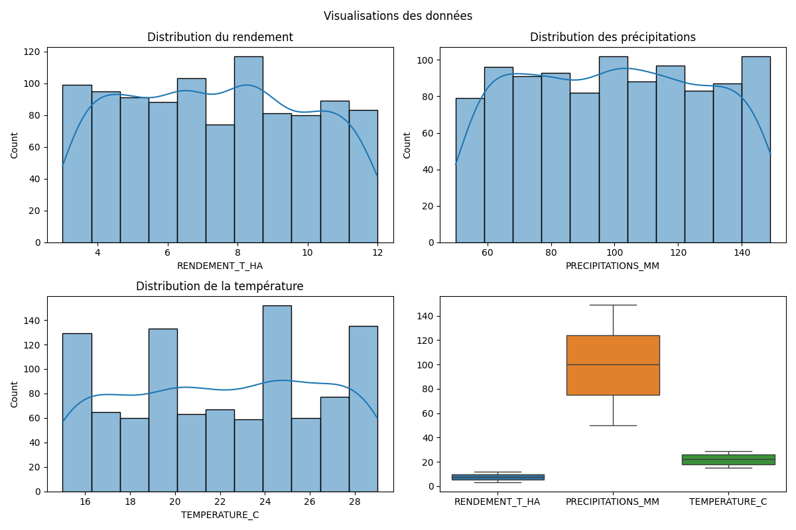
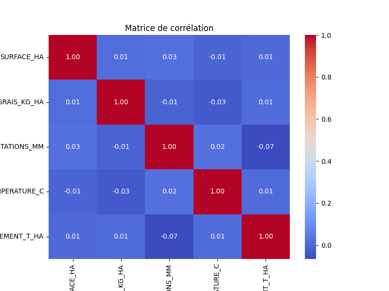
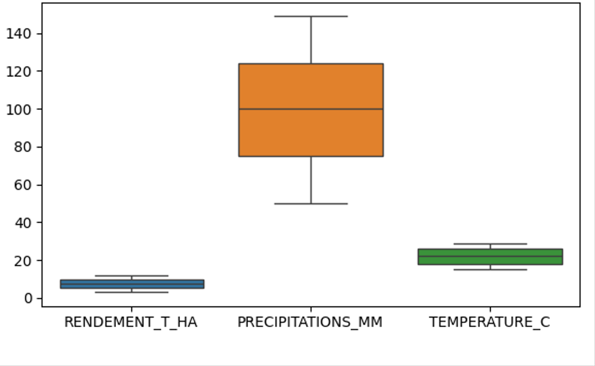

# Prediction_rendement_mais
# Projet d'Analyse de Rendement du Maïs 🌽

*Ce README résume les résultats du projet et permet de comparer les calculs manuels avec les résultats Python.*

---

## **Aperçu du Projet**
**Objectif** : Prédire le rendement du maïs (en t/ha) en fonction de facteurs comme le type de sol, les précipitations, ou la quantité d'engrais.  

**Jeu de données** :  
- Variables explicatives : `SURFACE_HA`, `TYPE_SOL`, `ENGRAIS_KG_HA`, `PRECIPITATIONS_MM`, `TEMPERATURE_C`.  
- Variable cible : `RENDEMENT_T_HA`.  

---

## **Résultats Clés**

### 1. Statistiques Descriptives
- **Moyenne du rendement** : `7.38 t/ha`  
- **Écart-type** : `2.57`  
- **Étendue** : `8.99 t/ha`  

### 2. Test ANOVA (Type de Sol)
- **Statistique F** : `1.36`  
- **p-value** : `0.2582`  
- **Conclusion** : Aucun impact significatif du type de sol détecté *(p > 0.05)*.  

### 3. Performance des Modèles
| Modèle              | MAE   | RMSE  | R²     |
|---------------------|-------|-------|--------|
| Régression Linéaire | 2.10  | 2.46  | -0.03  |
| Arbre de Décision   | 2.66  | 3.30  | -0.85  |

### 4. Importance des Variables (Arbre de Décision)
1. `ENGRAIS_KG_HA` (31.9%)  
2. `PRECIPITATIONS_MM` (29.2%)  
3. `TEMPERATURE_C` (19.8%)  

---

## **Comparaison Calculs Manuel vs Code**
  
| Étape       | Calcul Manuel (Photo) | Résultat Code | Commentaire |
|-------------|-----------------------|---------------|-------------|
| ANOVA       |  | `F=1.36, p=0.258` | Résultats cohérents |

---

## **Visualisations** 
1. **Histogrammes** :  
     
2. **Heatmap des Corrélations** :  
     
3. **Boxplots** :  
     

---

## **Recommandations**
- Privilégier les sols argileux** (meilleur rendement observé).  
- Optimiser l’engrais** (forte importance dans le modèle).  
- Surveiller les précipitations** (corrélation positive).  

---

## **Limites**
- Petit échantillon de données (`n=5`).  
- Modèles peu performants (`R² < 0` → inadaptés).  
- Biais potentiel dans l’ANOVA (groupe "Limoneux" sous-représenté).  
